# Semantic Segmentation

## Introduction
Semantic segmentation is a fundamental task in computer vision and enables many downstream applications. It is related to image classification since it produces per-pixel category prediction instead of image-level prediction. 

This task aims to test and compare several pre-trained semantic segmentation models. We will use two pre-training models to segment three videos in different situations and output semantically segmented video. Our video demo can be found on [here](https://drive.google.com/file/d/1ndLFwr12xZVtzgEEAu859QTt0uyNMtRg/view?usp=sharing).

## Models

We did not modify anything in the original open source code and tested two models that pretrained on the Cityscapes dataset.
### [SegFormer(2022)](https://github.com/NVlabs/SegFormer) :

SegFormer comprises a novel hierarchically structured Transformer encoder which generate high-resolution coarse features and low-resolution fine features. It does not need positional encoding, thereby avoiding the interpolation of positional codes which leads to decreased performance when the testing resolution differs from training. 

#### Evaluation

```CUDA 10.1``` and ```pytorch 1.7.1```

Install all requirements list on file ```SegFormer/requirements```.
Example: evaluate ```SegFormer-B4``` on ```Cityscapes```:

Download ``` segformer.b4.1024x1024.city.160k.pth ```  on  [trained weights](https://drive.google.com/drive/folders/1GAku0G0iR9DsBxCbfENWMJ27c5lYUeQA?usp=sharing) and save in file ``` SegFormer/checkpoints```

```python
python verification.py
```

### [DeepLabv3Plus(2020)](https://github.com/mskmei/DeepLabV3Plus-Pytorch) :

DeepLabV3+ extends DeepLabV3 by adding a simple yet effective decoder module to refine the segmentation results especially along object boundaries. 

1) DeepLab V3+ can arbitrarily control the resolution of extracted encoder features by atrous convolution to trade-off precision and available computation resources.

2) DeepLab V3+ adapt the Xception model for the segmentation task and apply depthwise separable convolution to both Atrous Spatial Pyramid Pooling and decoder module, resulting in a faster and stronger encoder-decoder network.

#### Evaluation

```CUDA 10.1``` and ```pytorch 1.7.1```

Install all requirements list on ```DeepLabV3Plus/requirements.txt```  

Example: evaluate ```DeepLabV3Plus-MobileNet``` on ```Cityscapes```:

Download ```best_deeplabv3plus_mobilenet_cityscapes_os16.pth``` on [trained weights](https://share.weiyun.com/aSKjdpbL) and save in file ``` DeepLabV3Plus/checkpoints```

```python
## Single Image
python predict.py --input data/000001.png  --dataset cityscapes --model deeplabv3plus_mobilenet --ckpt checkpoints/best_deeplabv3plus_mobilenet_cityscapes_os16.pth --save_val_results_to output_results

## Image folder (Use mmcv.VideoReader split video and save in file Images)
python predict.py --input data/Images  --dataset cityscapes --model deeplabv3plus_mobilenet --ckpt checkpoints/best_deeplabv3plus_mobilenet_cityscapes_os16.pth --save_val_results_to output_results
```

## Segmentation Results

### Daytime


<div align="center">
  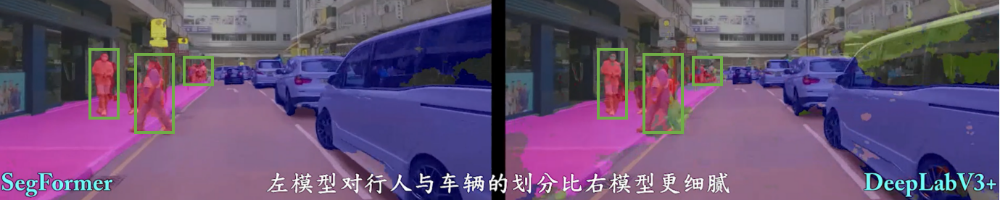
</div>
<p align="center">
</p>
<div align="center">
  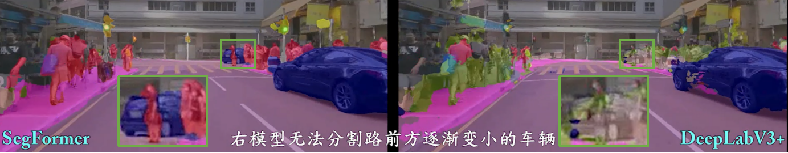
</div>
<p align="center">
</p>
<div align="center">
  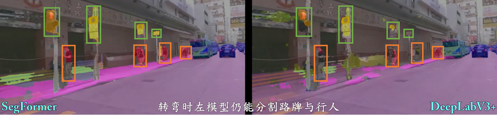
</div>
<p align="center">
</p>
<div align="center">
  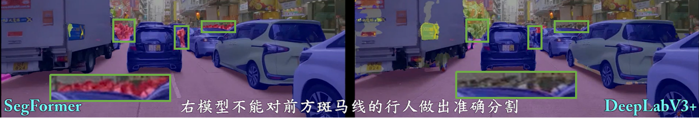
</div>
<p align="center">
</p>

### Night
<div align="center">
  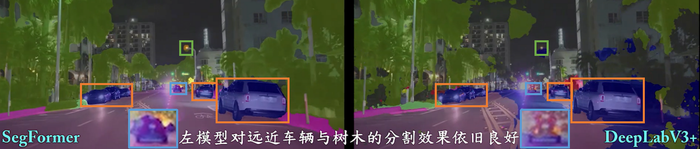
</div>
<p align="center">
</p>
<div align="center">
  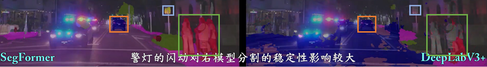
</div>
<p align="center">
</p>
<div align="center">
  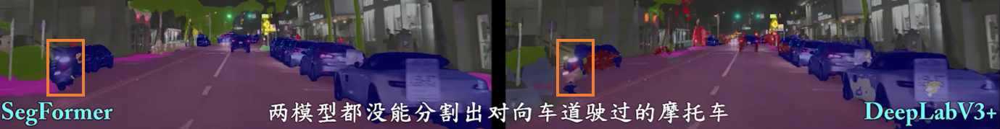
</div>
<p align="center">
</p>
<div align="center">
  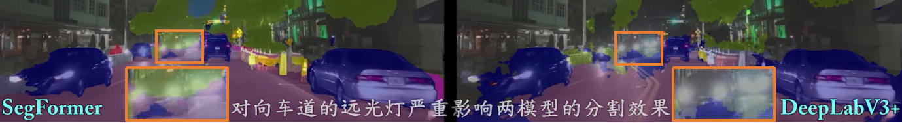
</div>
<p align="center">
</p>

### Foggy
<div align="center">
  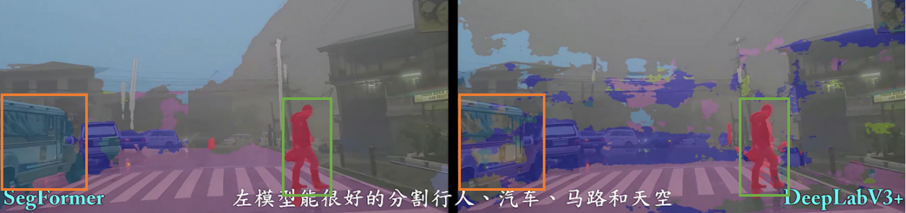
</div>
<p align="center">
</p>
<div align="center">
  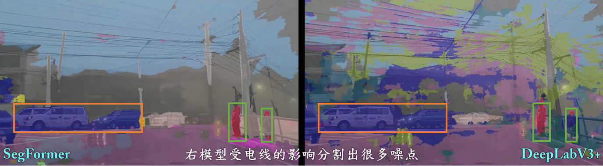
</div>
<p align="center">
</p>
<div align="center">
  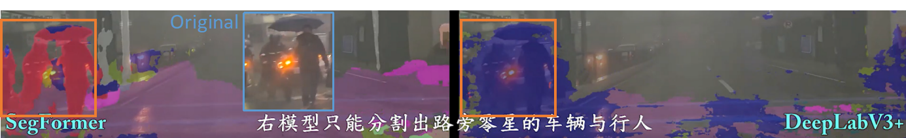
</div>
<p align="center">
</p>
<div align="center">
  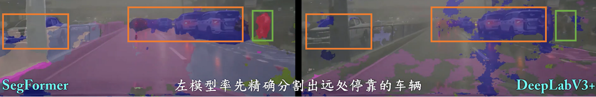
</div>
<p align="center">
</p>

## Video Clips Link

Daytime : https://youtube.com/clip/Ugkx4yIgClp66mB29fjTOR2ViGMmFHAZ2XsA

Night : [https://youtube.com/clip/UgkxvKzDpzTZ0JRWKgdrzaEifX0fdmIk6ESi](https://www.youtube.com/watch?v=Cod_ggrs69U&t=3189s)

Foggy : https://youtube.com/clip/UgkxxG9EjFW1wlu0Y3xap7-LNIrREysroFgF

## Reference

[1] [ SegFormer: Simple and Efficient Design for Semantic Segmentation with Transformers (arxiv.org)](https://arxiv.org/abs/2105.15203)

[2] [Encoder-Decoder with Atrous Separable Convolution for Semantic Image Segmentation (arxiv.org)](https://arxiv.org/abs/1802.02611)
