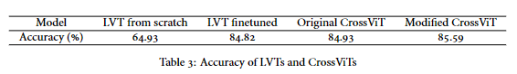
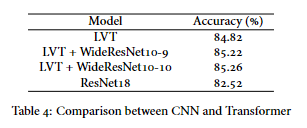
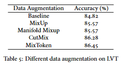
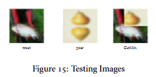
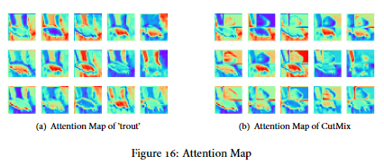

## Vision Transformer

We train LVT, CrossViT, ResNet18 in our project.

We run with pytorch 1.7.1. You should have visualizer installed. See [Link](https://github.com/luo3300612/Visualizer) for details.

Also to download the ImageNet pretrain weight for LVT and CrossViT from [here](https://pan.baidu.com/s/1dOw2wQLzM5PogYSl6RfhyQ?pwd=r389). 

### Train Transformer

```
python train_transformer.py --model {model name} --dataaug {data augmentation} --lr {learning rate} --epoch {epoch} --batch_size {batch size} --resume {whether to load from checkpoint}
```

Models should be chosen from 'lvt_finetune', 'lvt_params', 'lvt_flops', 'crossvit'.

Data augmentation should be chosen from 'baseline', 'mixup', 'manimix', 'cutmix', 'mixtoken'.

### Train ResNet18

```
python train_res.py
```

### Visulizer

`visualize.ipynb` shows the attention map of our model. 

Our models can be download from [here](https://pan.baidu.com/s/1dOw2wQLzM5PogYSl6RfhyQ?pwd=r389).

### Results











## Reference
[1] [Lite Vision Transformer with Enhanced Self-Attention](https://arxiv.org/abs/2112.10809)

[2] [CrossViT: Cross-Attention Multi-Scale Vision Transformer for Image Classification](https://arxiv.org/abs/2103.14899)

[3] [Visualizer](https://github.com/luo3300612/Visualizer)
